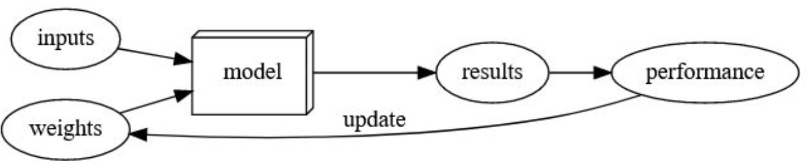

# 01_intro

## Do you need *Lots of math* for deep learning?

No

## Do you need *Lots of data* for deep learning?

No

## Do you need *Lots of expensive computers* for deep learning?

No

## Do you need a *PhD* for deep learning?

No

## Name (5/8) areas where deep learning is now the best in the world

- **Natural Language Processing** (NLP): Question Answering, Document Summarization and Classification, etc.
- **Computer Vision**: Satellite and drone imagery interpretation, face detection and recognition, image captioning, etc.
- **Medicine**: Finding anomalies in medical images (ex: CT, X-ray, MRI), detecting features in tissue slides (pathology), diagnosing diabetic retinopathy, etc.
- **Biology**: Folding proteins, classifying, genomics tasks, cell classification, etc.
- **Image generation/enhancement**: colorizing images, improving image resolution (super-resolution), removing noise from images (denoising), converting images to art in style of famous artists (style transfer), etc.
- **Recommendation systems**: web search, product recommendations, etc.
- **Playing games**: Super-human performance in Chess, Go, Atari games, etc
- **Robotics**: handling objects that are challenging to locate (e.g. transparent, shiny, lack of texture) or hard to pick up
- **Other applications**: financial and logistical forecasting; text to speech; much much more.

## What was the name of the first device that was based on the principle of the artificial neuron?

Mark I Perceptron built by Frank Rosenblatt

## What are the (8) requirements for "Parallel Distributed Processing" (based on the book of the same name)?

1. A set of **processing units**
2. A **state of activation**
3. An **output function** for each unit
4. A **pattern of connectivity** among units
5. A **propagation rule** for propagating patterns of activities through the network of connectivities
6. An **activation rule** for combining the inputs impinging on a unit with the current state of that unit to produce a new level of activation for the unit
7. A **learning rule** whereby patterns of connectivity are modified by experience
8. An **environment** within which the system must operate

## What were the $1^{st}$ theoretical misunderstandings that held back the field of neural networks?

In 1969, Marvin Minsky and Seymour Papert demonstrated in their book, **Perceptrons**, that a single layer of artificial neurons **cannot learn simple, critical mathematical functions like XOR logic gate**. While they subsequently demonstrated in the same book that additional layers can solve this problem, only the first insight was recognized, leading to the start of the first AI winter.

## What were the  $2^{nd}$ theoretical misunderstandings that held back the field of neural networks?

In the 1980’s, models with two layers were being explored. Theoretically, it is possible to approximate any mathematical function using two layers of artificial neurons. However, in practices, these networks were **too big and too slow**. While it was demonstrated that adding additional layers improved performance, this insight was not acknowledged, and the second AI winter began. In this past decade, with increased data availability, and improvements in computer hardware (both in CPU performance but more importantly in GPU performance), neural networks are finally living up to its potential.

## What is a GPU?

A **Graphics Processing Unit** (also known as a graphics card).

Standard computers have various components like CPUs, RAM, etc. CPUs, or central processing units, are the core units of all standard computers, and they execute the instructions that make up computer programs. GPUs, on the other hand, are specialized units meant for displaying graphics, especially the 3D graphics in modern computer games. The hardware optimizations used in GPUs allow it to handle thousands of tasks at the same time. Incidentally, these optimizations allow us to run and train neural networks hundreds of times faster than a regular CPU.

## When you open a notebook and execute a cell containing: 1+1, what happens?

The code is run by Python and the output is displayed underneath the code cell (in this case: 2).

## Why is it hard to use a traditional computer program to recognize images in a photo?

Because cats, dogs, or other objects, have a **wide variety of shapes, textures, colors, and other features**, and it is close to impossible to manually encode this in a traditional computer program.

For us humans, it is easy to identify images in a photos, such as identifying cats vs dogs in a photo. This is because, subconsciously our brains have learned which features define a cat or a dog for example. But it is hard to define rules for a traditional computer program to recognize a cat or a dog. Can you think of a universal rule to determine if a photo contains a cat or dog? How would you encode that as a computer program?

## What did Samuel mean by "weight assignment"?

**"Weight assignment" refers to the current values of the model parameters**. Arthur Samuel further mentions an :" *automatic means of testing the effectiveness of any current weight assignment* *" and a "* *mechanism for altering the weight assignment so as to maximize the performance* *". This refers to the evaluation and training of the model in order to obtain a set of parameter values that maximizes model performance.*

## What term do we normally use in deep learning for what Samuel called "weights"?

- **Parameters**

In deep learning, the term "weights" has a separate meaning. (The neural network has various parameters that we fit our data to. As shown in upcoming chapters, the two *types* of neural network parameters are weights and biases)

## Imagine a picture that summarizes Arthur Samuel’s view of a machine learning model

## Why is it hard to understand why a deep learning model makes a particular prediction?

Because of its **deep nature**.

Think of a linear regression model. Simply, we have some input variables/data that are multiplied by some weights, giving us an output. We can understand which variables are more important and which are less important based on their weights. A similar logic might apply for a small neural network with 1-3 layers. However, deep neural networks have hundreds, if not thousands, of layers. It is hard to determine which factors are important in determining the final output. The neurons in the network interact with each other, with the outputs of some neurons feeding into other neurons. Altogether, **due to the complex nature of deep learning models**, it is very difficult to understand why a neural network makes a given prediction.

However, in some cases, recent research has made it easier to better understand a neural network’s prediction. For example, as shown in this chapter, we can analyze the sets of weights and determine what kind of features activate the neurons. When applying CNNs to images, we can also see which parts of the images highly activate the model. We will see how we can make our models interpretable later in the book. In fact, interpretability is is a highly-researched topic known as of deep learning models.

## What is the name of the theorem that a neural network can solve any mathematical problem to any level of accuracy?

The **universal approximation theorem**

## What does the universal approximation theorem state?

It states that **neural networks can theoretically represent any mathematical function**. However, it is important to realize that practically, due to the limits of available data and computer hardware, it is impossible to practically train a model to do so, but we can get very close.

## What are the (5) things that you need in order to train a model?

- **Architecture** for the given problem
- **Data** to input to your model
- **Labels** (for most use-cases)
- **Loss** function that will quantitatively measure the performance of your model
- A way to **update the parameters** of the model in order to improve its performance (this is known as an optimizer)

## How could a feedback loop impact the rollout of a predictive policing model?

In a predictive policing model, we might end up with a positive feedback loop, leading to a **highly biased model with little predictive power**. For example, we may want a model that would predict crimes, but we use information on arrests as a *proxy*. However, this data itself is slightly biased due to the biases in existing policing processes. Training with this data leads to a biased model. Law enforcement might use the model to determine where to focus police activity, increasing arrests in those areas. These additional arrests would be used in training future iterations of models, leading to an even more biased model. This cycle continues as a *positive feedback loop*.

## Do we always have to use 224x224 pixel images with the cat recognition model?

**No**, we do not. 224x224 is commonly used for historical reasons. You can increase the size and get better performance, but at the price of speed and memory consumption.

## What is the difference between classification and regression?

- Classification is focused on predicting a **class or category** (ex: type of pet).
- Regression is focused on predicting a **numeric quantity** (ex: age of pet).

## What is a validation set? Why do we need it?

The validation **set is the portion of the dataset that is not used for training the model**, but for evaluating the model during training, in order to prevent overfitting. This ensures that the model performance is not due to "cheating" or memorization of the dataset, but rather because it learns the appropriate features to use for prediction.

## What is a test set? Why do we need it?

It is possible that we overfit the validation data because the human modeler is also part of the training process, adjusting *hyperparameters* and training procedures according to the validation performance. Therefore, **another unseen portion of the dataset**, the test set, is **used for final evaluation of the model**. This splitting of the dataset is necessary to ensure that the model *generalizes* to *unseen* data.

## What will fastai do if you don’t provide a validation set?

fastai will automatically **create a validation dataset**. It will randomly take 20% of the data and assign it as the validation set ( `valid_pct` = `0.2` ).

## Can we always use a random sample for a validation set? Why?

**No**, because a good validation or test set should be **representative of new data you will see in the future**. Sometimes this isn’t true if a random sample is used. For example, for time series data, selecting sets randomly does not make sense. Instead, defining different time periods for the train, validation, and test set is a better approach.

## What is overfitting?

Overfitting refers to **when the model fits too closely to a limited set of data but does not generalize well to unseen data**. This is especially important when it comes to neural networks, because neural networks can potentially *memorize* the dataset that the model was trained on, and will perform terribly on unseen data because it didn't *memorize* the ground truth values for that data. This is why a proper validation framework is needed by splitting the data into training, validation, and test sets.

P.S.: Overfitting is the most challenging issue when it comes to training machine learning models.

Here's a real world example:

Little Bobby loves cookies. His mother bakes chocolate chip cookies for him every Sunday. But, the world is not ideal and the cookies do not turn out equally tasty every Sunday. Some Sundays they taste better, some Sundays, they don’t taste as good. Being the curious little boy that he is, Bobby decides to find out when the cookies turn out to be tasty and when they don’t.

The first observation that he makes is that the number of chocolate chips in a cookie varies from cookie to cookie and that is pretty much the only directly observable thing that varies across cookies.

Now Bobby starts taking notes every Sunday.
After seven Sundays, his notes look something like this:

Sunday 1 – No. of Chocolate chips: 7; Tastiness: Awesome
Sunday 2 – No. of Chocolate chips: 4; Tastiness: Good
Sunday 3 – No. of Chocolate chips: 2; Tastiness: Bad
Sunday 4 – No. of Chocolate chips: 5; Tastiness: Terrible
Sunday 5 – No. of Chocolate chips: 3; Tastiness: Average
Sunday 6 – No. of Chocolate chips: 6; Tastiness: Terrible

This looks pretty straightforward. The more the number of chocolate chips, the tastier the cookie except that the notes from Sunday 4 and Sunday 6 seem to contradict this hypothesis. What little Bobby doesn’t know is that his mother forgot to put sugar in the cookies on Sunday 4 and Sunday 6.

Since Bobby is an innocent little kid, he doesn’t know that the world is far from ideal and things like randomness and noise are an integral part of it. He also doesn’t know that there are factors that are not directly observable. But, they do affect the outcomes of our experiments. So, he goes on to conclude that the tastiness of cookies increases with the number of chocolate chips when the number of chips is less than 5 and more than 6. But, drops drastically when the number of chocolate chips is 5 or 6.

He has come up with an overly complex, and not to forget, an incorrect hypothesis to explain how the tastiness of cookies varies because he tried to explain and justify his notes from every single Sunday. This is called over-fitting. Trying to explain/justify as many observations as possible by coming up with an overly complex (and possibly incorrect) hypothesis.

If, instead, he had treated Sunday 4 and Sunday 6 as just noise, his hypothesis would have been simpler and relatively more correct.

Source :

- [The example](https://qr.ae/pryKEh)
- [The rest](https://forums.fast.ai/t/fastbook-chapter-1-questionnaire-solutions-wiki/65647)

## What is a metric? How does it differ to "loss"?

- A *metric* is a **function that measures quality of the model's predictions using the validation set**.
- A *loss* is also a measure of performance of the model. However, **loss is meant for the optimization algorithm** (like SGD) to efficiently update the model parameters, while **metrics are human-interpretable measures of performance**. Sometimes, a metric may also be a good choice for the loss.

## How can pre-trained models help?

Pre-trained models have been **trained on other problems that may be quite similar to the current task**. For example, pre-trained image recognition models were often trained on the ImageNet dataset, which has 1000 classes focused on a lot of different types of visual objects. Pre-trained models are useful because they have already learned how to handle a lot of simple features like edge and color detection. However, since the model was trained for a different task than already used, this model cannot be used as is.

## What is the *head* of a model?

**This is the top of a network, the output layer**. It is a bit arbitrary.

For instance, on the bottom (where data comes in) you take convolution layers of some model, say resnet that we use in this course. If you call `ConvLearner.pre-trained`, `ConvnetBuilder` will build a network with appropriate head to your data. If you are working on a classification problem, it will create a head with a cross entropy loss and if you are working on a regression problem, it will create a head suited to that.

But you could build a model that has multiple heads. The model could take inputs from the base network (resnet convolutional layers) and feed the activations to some model, say `head1` and then same data to `head2`. Or you could have some number of shared layers built on top of resnet and only those layers feeding to `head1` and `head2`. You could even have different layers feed to different heads!

This is the general picture, but there are some nuances to this. For instance, with regards to the fastai lib, `ConvnetBuilder` will add an `AdaptivePooling` layer on top of the base network if you don’t specify the `custom_head` argument and if you do it won’t.

[Source](https://forums.fast.ai/t/terminology-question-head-of-neural-network/14819/3)

## What kinds of features do the **early** layers of a CNN find?

The simple features like diagonal, horizontal, and vertical edges.

## What kinds of features do the **later** layers of a CNN find?

The more advanced features like car wheels, flower petals, and even outlines of animals.

## Are image models only useful for photos?

**Nope! Image models can be useful for other types of images like sketches, medical data, etc.** However, a lot of information can be represented *as images* . For example, a sound can be converted into a spectrogram, which is a visual interpretation of the audio. Time series (ex: financial data) can be converted to image by plotting on a graph. Even better, there are various transformations that generate images from time series, and have achieved good results for time series classification. There are many other examples, and by being creative, it may be possible to formulate your problem as an image classification problem, and use pre-trained image models to obtain state-of-the-art results!

## What is a model's architecture?

The **architecture is the functional form of the model**. Indeed, a model can be split into an architecture and parameter(s). The parameters are some variables that define how the architecture operates.

For example, $y=ax+b$ is an architecture with the parameters $a$ and $b$ that change the behavior of the function.

[Source](https://nathanieldamours.github.io/blog/deep%20learning%20for%20coders/jupyter/2021/12/17/dl_for_coders_01.html#Architecture-and-Parameters)

## What is segmentation?

At its core, segmentation is a **pixelwise classification** problem. We attempt to predict a label for every single pixel in the image. This provides a mask for which parts of the image correspond to the given label.

## What is `y_range` used for? When do we need it?

`y_range` is being used to **limit the values predicted** when our problem is focused on predicting a numeric **value in a given range** (ex: predicting movie ratings, range of 0.5-5).

## What are "hyperparameters"?

They are **parameters that define *how* the model is trained**. For example, we could define how long we train for (the number of epochs) or how fast the model parameters are allowed to change (the learning rate).

## What’s the best way to avoid failures when using AI in an organization?

1. Make sure a training, validation, and testing set is defined properly in order to evaluate the model in an appropriate manner.
2. Try out a simple baseline, which future models should hopefully beat. Or even this simple baseline may be enough in some cases.
