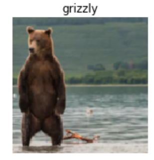
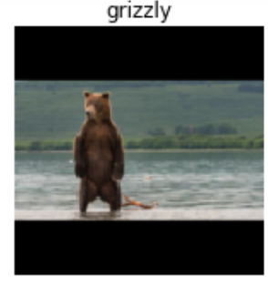

# 02_production

## Provide (5) examples of where the bear classification model might work poorly, due to structural or style differences to the training data

- The bear is partially **obstructed**
- **Nighttime** images are passed into the model
- **Low-resolution** images are passed into the model
- The bear is **far away** from the camera
- The bear training dataset is highly **biased** towards one type of features (eg. color)

P.S.: these cases were not represented in the training data

## Where do text models currently have a major deficiency?

Text models still struggle with ***correct* responses**. Given factual information (such as a knowledge base), it is still hard to generate responses that utilizes this information to generate factually correct responses, though the text can seem very compelling. This can be very dangerous, as the layman may not be able to evaluate the factual accuracy of the generated text. On the other hand, text models can generate context-appropriate text (like replies or imitating author style).

## What are (2) possible negative societal implications of text generation models?

- The ability for text generation models to generate context-aware, highly compelling responses can be used at a massive scale to spread disinformation ("fake news") and encourage conflict.
- Models reinforce bias (like gender bias, racial bias) in training data and create a vicious cycle of biased outputs.

## In situations where a model might make mistakes, and those mistakes could be harmful, what is a good alternative to automating a process?

The predictions of the model could be **reviewed by human experts** for them to evaluate the results and determine what is the best next step.

This is especially true for applying machine learning for medical diagnoses. For example, a machine learning model for identifying strokes in CT scans can alert high priority cases for expedited review, while other cases are still sent to radiologists for review. Or other models can also augment the medical professional’s abilities, reducing risk but still improving efficiency of the workflow. For example, deep learning models can provide useful measurements for radiologists or pathologists.

## What kind of tabular data is deep learning particularly good at?

Tabular data with:

- **natural language**
- **high cardinality categorical columns** (containing larger number of discrete choices like zip code).

## What’s a key downside of directly using a deep learning model for recommendation systems?

Deep learning will often **only tell what products a user might like**, and may not be recommendations that would be helpful to the user.

For example, if a user is familiar with other books from the same author, it isn’t helpful to recommend those products even though the user bought the author’s book. Or, recommending products a user may have already purchased.

## What are the steps of the Drivetrain approach?

- **Objective**: what outcome am I trying to achieve?
- **Levers**: what inputs can we control
- **Data**: what data can we collect
- **Models**: how the levers influence the objective


## How do the steps of the Drivetrain approach map to a recommendation system?

- The **objective** of a recommendation engine is to drive additional sales by surprising and delighting the customer with recommendations of items they would not have purchased without the recommendation.
- The **lever** is the ranking of the recommendations.
- New **data** must be collected to generate recommendations that will *cause new sales*. This will require conducting many randomized experiments in order to collect data about a wide range of recommendations for a wide range of customers. This is a step that few organizations take; but without it, you don't have the information you need to actually optimize recommendations based on your true objective (more sales!)

## What is `DataLoaders`?

The `DataLoaders` class is the class that passes the data to the fastai model. It is essentially a class that stores the required `Dataloader` objects (usually for train and validation sets).

## What four things do we need to tell fastai to create `DataLoaders`?

- What kinds of data we are working with (`blocks`)
- How to get the list of items (`get_items`)
- How to label these items (`get_y`)
- How to create the validation set (`splitter`)

For example,

```py
bears_datablock = DataBlock(
    blocks=(ImageBlock, CategoryBlock),
    get_items=get_image_files,
    get_y=parent_label,
    splitter=RandomSplitter(valid_pct=0.2, seed=123))

bears_dataloaders = bears_datablock.dataloaders(path)
```

## What does the splitter parameter to `DataBlock` do?

In fastai `DataBlock`, you provide the splitter argument a way for fastai to **split up the dataset into subsets** (usually train and validation set). For example, to randomly split the data, you can use fastai’s predefined `RandomSplitter` class, providing it with the proportion of the data used for validation.

## How do we ensure a random split always gives the same validation set?

**By using a random seed**. Indeed, it turns out it is impossible for our computers to generate truly random numbers. Instead, they use a process known as a pseudo-random generator. However, this process can be controlled using a random seed. By setting a random seed value (e.g. `random_seed=123`), the pseudo-random generator will generate the "random" numbers in a fixed manner and it will be the same for every run. Using a random seed, we can generate a random split that gives the same validation set always.

## What letters are often used to signify the independent and dependent variables?

- **x**: independent
- **y**: dependent

## What is `crop` and its disadvantage?

- `crop` is the default `Resize()` method, and it  ***crops*  the images** to fit a square shape of the size requested, using the full width or height.
- Disadvantage: this can result in losing some important details. For instance, if we were trying to recognize the breed of dog or cat, we may end up cropping out a key part of the body or the face necessary to distinguish between similar breeds.



## What is `pad` and its (2) disadvantages?

- `pad` is an alternative `Resize()` method, which **pads the matrix** of the image's pixels with zeros (which shows as black when viewing the images).
- Disadvantages: if we pad the images then we have a whole lot of empty space, which is just wasted computation for our model, and results in a lower effective resolution for the part of the image we actually use.



## What is `squish` and its disadvantage?

- `squish` is another alternative `Resize()` method, which can **either squish or stretch** the image.
- Disadvantage: this can cause the image to take on an unrealistic shape, leading to a model that learns that things look different to how they actually are, which we would expect to result in lower accuracy.


## What is `RandomResizedCrop`?

A method in which we **crop on a randomly selected region of the image**. So every epoch, the model will see a different part of the image and will learn accordingly.

## What is data augmentation?

**It refers to creating random variations of our input data**, such that they appear different, but not so different that it changes the meaning of the data. Examples include flipping, rotation, perspective warping, brightness changes, etc.

## Why is data augmentation needed?

Because it helps the model to **understand the basic concept of what an object is** and **how the objects of interest are represented in images**. Therefore, data augmentation allows machine learning models to *generalize*. This is especially important when it can be slow and expensive to label data.

## What is the difference between `item_tfms` and `batch_tfms`?

- `item_tfms` are transformations **applied to a single data sample `x` on the CPU**. `Resize()` is a common transform because the mini-batch of input images to a cnn must have the same dimensions. Assuming the images are RGB with 3 channels, then `Resize()` as item_tfms will make sure the images have the same width and height.
- `batch_tfms` are **applied to batched data samples** (aka individual samples that have been collated into a mini-batch) **on the GPU**. They are faster and more efficient than `item_tfms`. A good example of these are the ones provided by `aug_transforms()`. Inside are several batch-level augmentations that help many models.

## What is a confusion matrix?

It's a **representation of the predictions made vs the correct labels**. The rows of the matrix represent the actual labels while the columns represent the predictions. Therefore, the number of images in the diagonal elements represent the number of correctly classified images, while the off-diagonal elements are incorrectly classified images. Class confusion matrices provide useful information about how well the model is doing and which classes the model might be *confusing*.

Here is a confusion matrix,

| Total population (P + N) | Positive prediction | Negative prediction |
| :----------------------: | :-----------------: | :-----------------: |
|  Actually positive (P)   | True positive (TP)  | False negative (FN) |
|  Actually negative (N)   | False positive (FP) | True negative (TN)  |

And here, a practical example,

| Total population (12) | Cancer prediction (9) | Non-cancer prediction (3) |
| :-------------------: | :-------------------: | :-----------------------: |
|   Actual cancer (7)   |           6           |             1             |
| Actual non-cancer (5) |           3           |             2             |

## What does `export` save?

- The architecture
- The trained parameters of the neural network architecture
- How the `DataLoaders` are defined

## What is it called when we use a model for getting predictions, instead of training?

Inference

## What are IPython widgets?

IPython widgets are JavaScript and Python combined functionalities that let us **build and interact with GUI components directly in a Jupyter notebook**. An example of this would be an upload button, which can be created with the Python function `widgets.FileUpload()`.

## When might you want to use GPU for deployment? When might CPU be better?

- **GPUs are best for doing identical work in parallel**. GPUs could be used if you collect user responses into a batch at a time, and perform inference on the batch. This may require the user to wait for model predictions. Additionally, there are many other complexities when it comes to GPU inference, like memory management and queuing of the batches.

- **CPU** may be more cost effective if you will be **analyzing single pieces of data at a time** (like a single image or single sentence), especially with more market competition for CPU servers versus GPU servers.

## What are the downsides of deploying your app to a server, instead of to a client (or edge) device such as a phone or PC?

The application will:

- require network connection
- need extra network latency time when submitting input and returning results.
- lead to security concerns if you send private data to a network server

Deploying a model to a server will:

- makes it easier to iterate and roll out new versions of a model. This is because you as a developer have full control over the server environment and only need to do it once rather than having to make sure that all the endpoints (phones, PCs) upgrade their version individually.

## Name (3) examples of situations that could lead to a poor performance when rolling out a bear warning system in practice?

- Handling **night-time** images
- Dealing with **low-resolution** images (ex: some smartphone images)
- The model returns prediction too **slowly** to be useful

## What is "out of domain data"?

Data that is **fundamentally different** in some aspect compared to the model's training data. For example, an object detector that was trained exclusively with outside daytime photos is given a photo taken at night.

## What is "domain shift"?

This is **when the type of data changes gradually over time**. For example, an insurance company is using a deep learning model as part of their pricing algorithm, but over time their customers will be different, with the original training data not being representative of current data, and the deep learning model being applied on effectively out-of-domain data.

## What are the (3) steps in the deployment process?

1. **Manual process** – the model is run in parallel and not directly driving any actions, with humans still checking the model outputs.
2. **Limited scope deployment** – The model’s scope is limited and carefully supervised. For example, doing a geographically and time-constrained trial of model deployment, that is carefully supervised.
3. **Gradual expansion** – The model scope is gradually increased, while good reporting systems are implemented in order to check for any significant changes to the actions taken compared to the manual process (i.e. the models should perform similarly to the humans, unless it is already anticipated to be better).

## For a project you’re interested in applying deep learning to, consider the thought experiment "what would happen if it went really, really well?"

To be done by reader...

## Start a blog, and write your first blog post. For instance, write about what you think deep learning might be useful for in a domain you’re interested in

To be done by reader... Check [this forum post](https://forums.fast.ai/t/fastai2-blog-posts-projects-and-tutorials/65827) for inspiration.
