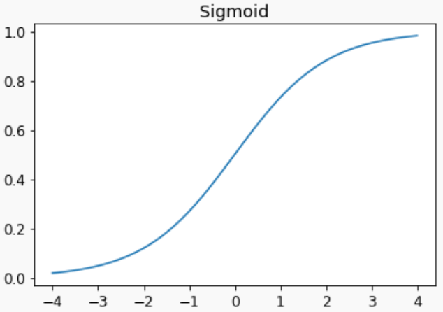
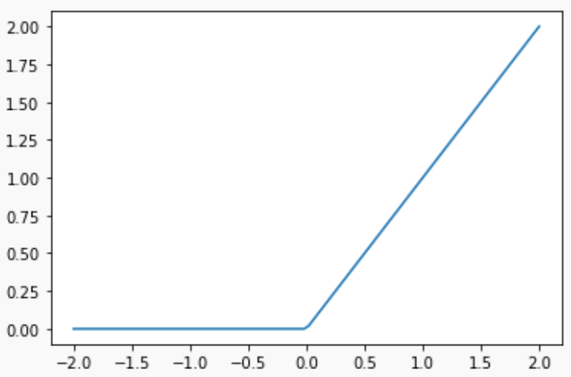

# 04_mnist_basics

## How is an image represented on a computer? How about a gray image and a color image?

- **Images** are represented by arrays with pixel values representing the content of the image.

- For **grayscale images**, a 2-dimensional array is used with the pixels representing the grayscale values, with a range of 256 integers. A value of 0 would represent white, and a value of 255 represents black, and different shades of grayscale in between.

- For **color images**, three color channels (red, green, blue) are typically used, with a separate 256-range 2D array used for each channel. A pixel value of 0 again represents white, with 255 representing solid red, green, or blue. The three 2-D arrays form a final 3-D array (rank 3 tensor) representing the color image.

## How are the files and folders in the `MNIST_SAMPLE` dataset structured? Why?

There are **two subfolders**, `train` and `valid`, the former contains the data for model training, the latter contains the data for validating model performance after each training step. It is structured this way, because it allows to **simplify comparing results between implementations/publications**.

Evaluating the model on the validation set serves two purposes:

- to report a human-interpretable metric such as accuracy (in contrast to the often abstract loss functions used for training)
- to facilitate the detection of overfitting by evaluating the model on a dataset it hasn't been trained on (in short, an overfitting model performs increasingly well on the training set but decreasingly so on the validation set).

Of course, every practitioner could generate their own train/validation-split of the data. As specified earlier, public datasets are usually pre-split to simplify comparing results between implementations/publications.

Each subfolder has two subsubfolders `3` and `7` which contain the `.jpg` files for the respective class of images. This is a common way of organizing datasets comprised of pictures. For the full `MNIST` dataset there are 10 subsubfolders, one for the images for each digit.

## Explain how the "pixel similarity" approach to classifying digits works

In the "pixel similarity" approach, we **generate an archetype for each class** we want to identify. In our case, we want to distinguish images of 3's from images of 7's. We define the archetypical 3 as the pixel-wise mean value of all 3's in the training set. Analogously for the 7's. You can visualize the two archetypes and see that they are in fact blurred versions of the numbers they represent.

In order to tell if a previously unseen image is a 3 or a 7, we calculate its distance to the two archetypes (here: mean pixel-wise absolute difference). We say the new image is a 3 if its distance to the archetypical 3 is lower than two the archetypical 7.

## What is a list comprehension?

A list comprehension is a Pythonic way of condensing the creation of a list using a `for`-loop into a single expression. List comprehensions will also often include if clauses for filtering.

For example,

```py
>>> zero_to_four = [i for i in range(5)]
>>> zero_to_four
[0, 1, 2, 3, 4]
```

is equal to :

```py
>>> zero_to_four = []
>>> for i in range(5):
>>>    zero_to_four.append(i)
>>> zero_to_four
[0, 1, 2, 3, 4]
```

## Create a list comprehension that selects odd numbers from an iterator (like `range()`) and doubles them

```py
>>> odd_numbers_times_3 = [3*i for i in range(5) if i%2 == 1]
>>> odd_numbers_times_3
[3, 9]
```

is equal to :

```py
>>> odd_numbers_times_3 = []
>>> for i in range(5):
>>>     if i%2 == 1:
>>>         odd_numbers_times_3.append(3*i)
>>> odd_numbers_times_3
[3, 9]
```

## What is the rank of a tensor?

It's the **number of dimensions** (or axes) it has. An easy way to identify the rank is the number of indices you would need to reference a number within a tensor. A scalar can be represented as a tensor of rank 0 (no index), a vector can be represented as a tensor of rank 1 (one index, e.g., `v[i]`), a matrix can be represented as a tensor of rank 2 (two indices, e.g., `a[i, j]`), and a tensor of rank 3 is a cuboid or a "stack of matrices" (three indices, e.g., `b[i, j, k]`). In particular, the rank of a tensor is independent of its shape or dimensionality, e.g., a tensor of shape 2x2x2 and a tensor of shape 3x5x7 both have rank 3.

Note that the term "rank" has different meanings in the context of tensors and matrices (where it refers to the number of linearly independent column vectors).

## What is the difference between tensor rank and shape?

- **Rank** : number of dimensions (or axes) in a tensor
- **Shape** : size of each axis of a tensor

## How do you get the rank from the shape of a tensor?

**The length of a tensor's shape** is its rank. So if we have the images of the 3's folder from the `MNIST_SAMPLE` dataset in a tensor called `stacked_threes`, we find its shape like this:

```py
>>> stacked_threes.shape
torch.Size([6131, 28, 28])
```

And it's rank like this:

```py
>>> len(stacked_threes.shape)
3
```

You can also get a tensor's rank directly with `ndim`:

```py
>>> stacked_threes.ndim
3
```

## What are RMSE and L1 norm?

Root mean square error (RMSE), also called the L2 norm, and mean absolute difference (MAE), also called the L1 norm, are two commonly used **methods of measuring "distance"**. Simple differences do not work because some difference are positive and others are negative, canceling each other out. Therefore, a function that focuses on the magnitudes of the differences is needed to properly measure distances. The simplest would be to add the absolute values of the differences, which is what MAE is. RMSE takes the mean of the square (makes everything positive) and then takes the square root (undoes squaring).

## How can you apply a calculation on thousands of numbers at once, many thousands of times faster than a Python loop?

As loops are very slow in Python, it is best to **represent the operations as array operations** rather than looping through individual elements. If this can be done, then using NumPy or PyTorch will be thousands of times faster, as they use underlying C code which is much faster than pure Python. Even better, PyTorch allows you to run operations on GPU, which will have significant speedup if there are parallel operations that can be done.

## Create a 3x3 tensor or array containing the numbers from 1 to 9. Double it. Select the bottom right 4 numbers

```py
>>> tensor_3x3 = torch.Tensor(list(range(1, 10))).view(3, 3)
>>> tensor_doubled = 2*tensor_3x3
>>> tensor_bottom_right = tensor_doubled[1:, 1:]

>>> tensor_3x3
tensor([[1., 2., 3.],
        [4., 5., 6.],
        [7., 8., 9.]])

>>> tensor_doubled
tensor([[ 2.,  4.,  6.],
        [ 8., 10., 12.],
        [14., 16., 18.]])

>>> tensor_bottom_right
tensor([[10., 12.],
        [16., 18.]])
```

## What is broadcasting?

**Tensors with smaller rank are expanded to have the same size as the larger rank tensor** in the case of PyTorch. In this way, operations can be performed between tensors with different rank. Fortunately, scientific/numerical Python packages like NumPy and PyTorch will often implement broadcasting that often makes code easier to write.

## Are metrics generally calculated using the training set, or the validation set? Why?

**Metrics are generally calculated on a validation set**. As the validation set is unseen data for the model, evaluating the metrics on the validation set is better in order to determine if there is any overfitting and how well the model might generalize if given similar data.

## What is SGD?

SGD, or stochastic gradient descent, is an **optimization algorithm**. Specifically, SGD is an algorithm that will update the parameters of a model in order to minimize a given loss function that was evaluated on the predictions and target. The key idea behind SGD (and many optimization algorithms, for that matter) is that the gradient of the loss function provides an indication of how that loss function changes in the parameter space, which we can use to determine how best to update the parameters in order to minimize the loss function. This is what SGD does.

## Why does SGD use mini-batches?

Because, most of the time, it leads to **better performances**. Indeed, if we iterated through each instances the gradient will be unstable and imprecise. This is not suitable for training. On the other hand, if we calculate the gradient from a batch (dataset), we might get stuck in a local minimum (because we loose the power of the *randomness* of the stochastic gradient descent). This (usually) means that the model won't perform its best. Therefore, we need to use mini-batches.

## What are the (7) steps in SGD for machine learning?

1. **Initialize the parameters**: random values often work best.
2. Calculate the **predictions**: this is done on the training set, one mini-batch at a time.
3. Calculate the **loss**: the average loss over the mini-batch is calculated
4. Calculate the **gradients**: this is an approximation of how the parameters need to change in order to minimize the loss function
5. **Step the weights**: update the parameters based on the calculated weights
6. **Repeat** the process
7. **Stop**: in practice, this is either based on time constraints or usually based on when the training/validation losses and metrics stop improving.

## How do we initialize the weights in a model?

**Random** weights work pretty well.

## What is "loss"?

It's a function that returns a value based on the given predictions and targets, where lower values correspond to better model predictions.

## Why can’t we always use a high learning rate?

**The loss may "bounce" around (oscillate) or even diverge**, as the optimizer is taking steps that are too large, and updating the parameters faster than it should be.

## What is a "gradient"?

The gradients is a **measure that tells us how much we have to change each weight** to make our model better. Indeed, this is a measure of how the loss function changes with changes of the weights of the model (the derivative).

## Do you need to know how to calculate gradients yourself?

No, deep learning libraries will automatically calculate the gradients for you. This feature is known as automatic differentiation. In PyTorch, if `requires_grad=True`, the gradients can be returned by calling the backward method: `loss.backward()`

## Why can’t we use accuracy as a loss function?

Because a **loss function needs to change as the weights are being adjusted**. Accuracy only changes if the predictions of the model change. So if there are slight changes to the model that, say, improves confidence in a prediction, but does not change the prediction, the accuracy will still not change. Therefore, the gradients will be zero everywhere except when the actual predictions change. The model therefore cannot learn from the gradients equal to zero, and the model’s weights will not update and will not train. A good loss function gives a slightly better loss when the model gives slightly better predictions. Slightly better predictions mean if the model is more confident about the correct prediction. For example, predicting 0.9 vs 0.7 for probability that a MNIST image is a 3 would be slightly better prediction. The loss function needs to reflect that.

## Imagine the sigmoid function. What is special about its shape?



Sigmoid function is a **smooth curve that squishes all values into values from 0 to 1**. Most loss functions assume that the model is outputting some form of a probability or confidence level between 0 and 1 so we use a sigmoid function at the end of the model in order to do this.

Its formula:
$ \sigma(x) = \frac{1}{1 + e^{-x}} \sigma(x) = \frac{1}{1 + e^{-x}} $

## What is the difference between loss and metric?

- **Metric**: drives human understanding
- **Loss**: drives automated learning

In order for loss to be useful for training, it needs to have a meaningful derivative. Many metrics, like accuracy are not like that. Metrics instead are the numbers that humans care about, that reflect the performance of the model.

## What is the function to calculate new weights using a learning rate?

The optimizer `step()` function

## What does the DataLoader class do?

The DataLoader class can take any Python collection and turn it into an iterator over many batches.

## Write pseudo-code showing the basic steps taken each epoch for SGD

```py
for inputs, targets in train_dataloaders:
    pred = model(inputs)
    loss = loss_func(pred, targets)
    loss.backward()
    model.params -= model.params.grad * lr
```

## Create a function which, if passed two arguments `[1, 2, 3, 4]` and `'abcd'` , returns `[(1, 'a'), (2, 'b'), (3, 'c'), (4, 'd')]`. What is special about that output data structure?

```py
def func(a, b):
    return list(zip(a, b))
```

This data structure is useful for machine learning models when you need lists of tuples where each tuple would contain input data and a label.

## What does view do in PyTorch?

It changes the **shape** of a Tensor without changing its contents.

## What is the *bias* parameter in a neuron?

It is a term $b$ that we add to the multiplication of the weight by the input ($wx$) in a neuron where its output is $y = f_{activation}(wx + b)$.

## Why do we need the *bias* parameter in a neuron?

Because the bias adds **flexibility**. Indeed, without the bias parameters, if the input is zero, the output will always be zero, since $y = 0$ where $y = wx$ and $x = 0$. On the other hand, if the bias is present, we will obtain $y = b$.

## What does the @ operator do in python?

This is the **matrix multiplication** operator.

## What does the `backward` method do?

It returns the current **gradients**.

## Why do we have to zero the gradients?

Because PyTorch will **add the gradients of a variable to any previously stored gradients**. If the training loop function is called multiple times, without zeroing the gradients, the gradient of current `loss` would be added to the previously stored gradient value.

## What information do we have to pass to Learner ?

- The DataLoaders
- The model
- The optimization function
- The loss function
- (optionally) any metrics to print.

## Show pseudo-code (inspired from python) for the basic steps of a training loop

```py
def training_loop():
    for _ in range(n_epoch):
        for batch in training_data_loader:
            training_step(batch)

def training_step(batch):
    for inputs, targets in batch:
        predictions = model(inputs)
        loss = loss_function(predictions, targets)
        loss.backward()
        model.params.data -= lr * model.params.gradient.data
        params.grad = None
```

## What is "ReLU"? Draw a plot of it for values from -2 to +2



ReLU just means "replace any negative numbers with zero". It is a commonly used activation function.

## What is an "activation function"?

The activation function of a neuron is a **function that modifies the output of this neuron**. For example, the sigmoid function (as you saw earlier) is an activation function.

Usually, activation functions provide *non-linearity* to the model. The idea is that without non-linear activation functions, we just have multiple linear functions of the form `y = mx + b`. However, a series of linear layers is equivalent to a single linear layer, so our model can only fit a line to the data. By introducing a non-linearity in between the linear layers, this is no longer true. Each layer is somewhat decoupled from the rest of the layers, and the model can now fit much more complex functions. In fact, it can be mathematically proven that such a model can solve any computable problem to an arbitrarily high accuracy, if the model is large enough with the correct weights. This is known as the universal approximation theorem.

## What’s the difference between `F.relu` and `nn.ReLU` ?

- `F.relu`: a Python function for the relu activation function
- `nn.ReLU`: is a PyTorch module This means that it is a Python class that can be called as a function in the same way as `F.relu`

## The universal approximation theorem shows that any function can be approximated as closely as needed using just one nonlinearity. So why do we normally use more?

There are practical **performance** benefits to using more than one nonlinearity. We can use a deeper model with less number of parameters, better performance, faster training, and less compute/memory requirements.
