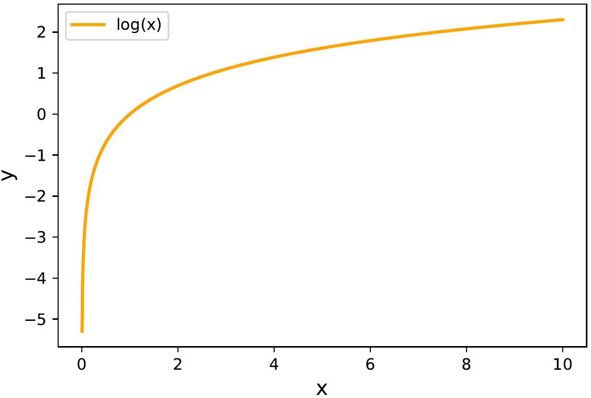

# 05_pet_breeds

## Why do we first resize to a large size on the CPU, and then to a smaller size on the GPU?

Because we want to **minimize data destruction**. Indeed, data augmentation can lead to degradation of the artifacts, especially at the edges. Therefore, the augmentations are done on a larger image, and then `RandomResizeCrop` is performed to resize to the final image size. Also, resizing to a large size on the CPU, and then to a smaller size on the GPU is known as presizing.

Also, this presizing is done on the CPU, because the CPU can use higher-quality resampling filters, such as bicubic interpolation, which can produce smoother and more accurate results than the resampling filters available on the GPU. Resizing on the CPU can therefore **produce higher-quality images** that are more suitable for further processing on the GPU.

Source :

- [First paragraph](https://forums.fast.ai/t/fastbook-chapter-5-questionnaire-solutions-wiki/69301)
- [Second paragraph](https://chat.openai.com/chat)

## What are the two ways in which data is most commonly provided, for most deep learning datasets?

1. **Individual files representing items of data**, such as text documents or images.
2. **A table of data**, such as in CSV format, where each row is an item, each row which may include filenames providing a connection between the data in the table and data in other formats such as text documents and images.

## Give (2) examples of ways that image transformations can degrade the quality of the data

1. **Rotation** can leave empty areas in the final image
2. Other operations may require **interpolation** which is based on the original image pixels, but are still of lower image quality

## What method does fastai provide to view the data in a DataLoader?

`DataLoader.show_batch`

## What method does fastai provide to help you debug a DataBlock?

`DataBlock.summary`

## Should you hold off on training a model until you have thoroughly cleaned your data?

**No**. It is best to create a baseline model as soon as possible.

## What are the (2) pieces that are combined into cross entropy loss in PyTorch?

- Softmax function
- Negative log likelihood loss

## What are the (2) properties of activations that softmax ensures? Why is this important?

- It makes the outputs for the classes **add up to one**. This means the model can **only predict one class**.
- It **amplifies small changes** in the output activations.

This is helpful, because it means the model will **select a label with higher confidence** (good for problems with definite labels).

## When might you want your activations to not have the two properties that softmax ensures?

When you have **multi-label** classification problems (more than one label possible).

## Why can’t we use `torch.where` to create a loss function for datasets where our label can have more than two categories?

Because `torch.where` can only select between **two** possibilities while for multi-class classification, we have **multiple** possibilities.

## What is the value of log(-2)? Why?

This value is not defined. The logarithm is the inverse of the exponential function, and the exponential function is always positive no matter what value is passed. So the logarithm is not defined for negative values.

## What are (2) good rules of thumb for picking a learning rate from the learning rate finder?

- One order of magnitude less than where the **minimum loss** was achieved (i.e. the minimum divided by 10)
- The last point where the loss was clearly **decreasing**

## What (2) steps does the `fine_tune` method do?

1. Train the new **head** (with random weights) for one epoch
2. Unfreeze all the **layers** and train them all for the requested number of epochs

## In Jupyter notebook, how do you get the source code for a method or function?

Use `??` after the function. For example, `DataBlock.summary??`

## What are discriminative learning rates?

Discriminative learning rates refers to the training trick of **using different learning rates for different layers** of the model. This is commonly used in transfer learning. The idea is that when you train a pre-trained model, you don’t want to drastically change the earlier layers as it contains information regarding simple features like edges and shapes. But later layers may be changed a little more as it may contain information regarding facial feature or other object features that may not be relevant to your task. Therefore, the earlier layers have a lower learning rate and the later layers have higher learning rates.

## How is a Python slice object interpreted when passed as a learning rate to fastai?

- **First value** : learning rate for the earliest layer
- **Second value**: learning rate for the last layer

The layers in between will have learning rates that are multiplicatively equidistant throughout that range.

## Why is early stopping a poor choice when using one cycle training?

Because the training may **not have time to reach lower learning rate** values in the learning rate schedule, which could easily continue to improve the model. Therefore, it is recommended to retrain the model from scratch and select the number of epochs based on where the previous best results were found.

## What is the difference between `resnet50` and `resnet101`?

The number 50 and 101 refer to the **number of layers** in the models. Therefore, `resnet101` is a larger model with more layers versus `resnet50`. These model variants are commonly as there are ImageNet-pre-trained weights available.

## What does `to_fp16` do?

This enables mixed-precision training, in which less precise numbers are used in order to speed up training.
