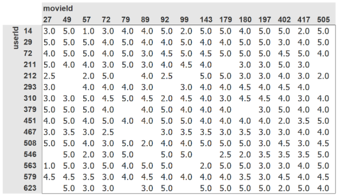

# 08_collab

## What problem does collaborative filtering solve?

The problem of predicting the interests of users based on the interests of other users and recommending items based on these interests

## How does collaborative filtering solve their problem?

**By using `latent factors`**. The idea is that the model can tell what kind of items you may like (ex: you like sci-fi movies/books) and these kinds of factors are _learned_ (via basic gradient descent) based on what items other users like.

## Why might a collaborative filtering predictive model fail to be a very useful recommendation system?

Because:

- there are not many recommendations to learn from
- there are not enough data about the user to provide useful recommendations

## What does a crosstab representation of collaborative filtering data look like?



The users and items are the rows and columns (or vice versa) of a large matrix with the values filled out based on the user's rating of the item.

## What is a latent factor?

It's a factor is not explicitly given to the model and instead **learned** (hence "latent"). This factor is important for the prediction of the recommendations.

For example, suppose that you observe the behaviour of a person or animal. You can only observe the behaviour. You cannot observe the internal state (e.g. the mood) of this person or animal. The mood is a hidden variable because it cannot be observed directly (but only indirectly through its consequences).

Source :

- [Description](https://forums.fast.ai/t/fastbook-chapter-8-questionnaire-solutions-wiki/69926)
- [Example](https://ai.stackexchange.com/a/12505)

## What is a dot product?

It's when you multiply the corresponding elements of two vectors and add them up. If we represent the vectors as lists of the same size, here is how we can perform a dot product:

```py
>>> a = [1, 2, 3, 4]
>>> b = [5, 6, 7, 8]
>>> dot_product = sum(elements[0]*elements[1] for elements in zip(a, b))
>>> dot_product
70
```

## What does `pandas.DataFrame.merge` do?

It allows you to merge `DataFrames` into one `DataFrame`.

## What is an embedding matrix?

What you multiply an embedding with and, in the case of this collaborative filtering problem, what is learned through training

## What is the relationship between an embedding and a matrix of one-hot encoded vectors?

An embedding is a dense, continuous representation of a categorical variable, while a one-hot encoded matrix is a sparse, discrete representation of the same variable. An embedding is often used as an alternative to a one-hot encoded matrix in order to reduce the dimensionality and computational cost of a model.

[Source](https://chat.openai.com/chat)

## Why do we need `Embedding` if we could use one-hot encoded vectors for the same thing?

`Embedding` is **computationally more efficient**. The multiplication with one-hot encoded vectors is equivalent to indexing into the embedding matrix, and the `Embedding` layer does this. However, the gradient is calculated such that it is equivalent to the multiplication with the one-hot encoded vectors.

## What does an embedding contain before we start training (assuming we're not using a pre-trained model)?

**Random values**. For example,

```py
>>> embedding = Embedding(3, 2)
>>> list(embedding.parameters())
[Parameter containing:
 tensor([[ 0.0102,  0.0115],
         [-0.0006, -0.0036],
         [ 0.0111, -0.0069]], requires_grad=True)]
```

## What does `my_tensor[0, :]` return?

All the columns of the first row of the matrix `my_tensor`.

```py
>>> my_tensor = torch.Tensor([[1, 2, 3],
                              [4, 5, 6],
                              [7, 8, 9]])
>>> my_tensor[0, :]
tensor([1., 2., 3.])
```

## Rewrite the `DotProduct` class

```py
class DotProduct(Module):
     def __init__(self, n_users, n_movies, n_factors, y_range=(0, 5.5)):
         self.user_factors = Embedding(n_users, n_factors)
         self.movie_factors = Embedding(n_movies, n_factors)
         self.y_range = y_range

     def forward(self, x):
         users = self.user_factors(x[:, 0])
         movies = self.movie_factors(x[:, 1])
         return sigmoid_range((users * movies).sum(dim=1), *self.y_range)
```

## What is the use of bias in a dot product model?

A bias will **compensate for the extreme values**. For example, for a movie classifier, a bias will compensate for the fact that some movies are just amazing or pretty bad. It will also compensate for users who often have more positive or negative recommendations in general.

## What is weight decay?

A regularization technique that adds a penalty to the loss (usually the L2 norm).

Therefore, `loss = loss + weight_decay_penalty`

[Source](https://medium.com/datathings/dense-layers-explained-in-a-simple-way-62fe1db0ed75)

## Code a weight decay using L2 regularisation

```py
l2_reg = weight_decay_param*(model_params**2).sum()
loss = loss + l2_reg
```

## What do we add to the gradient when we use weight decay?

```py
2*weight_decay_param*params
```

## Why does the gradient of weight decay with L2 regularization help reduce weights?

Because weight decay with L2 regularization **adds a penalty** to the loss based on the weights. The bigger they are, the bigger is the penalty. Therefore, in order to reduce the loss, the optimizer will usually reduce the weights.

## Why does reducing weights lead to better generalization?

Because it reduces the **degree of freedom** of the model to fit the training data. Therefore, the model will be less likely to overfit.

## What does `argsort` do in PyTorch?

Returns the indices that would sort a tensor.

```py
>>> a = torch.randn(4)
>>> a
tensor([ 0.1280, -1.5398,  0.4009,  2.9171])
>>> torch.argsort(a)
tensor([1, 0, 2, 3])
```

## Does sorting the movie biases give the same result as averaging overall movie ratings by movie? Why?

**No**, it means much more than that because it takes into account the genres, the actors or other factors. For example, movies with low bias means even if you like these types of movies you may not like this movie (and vice versa for movies with high bias).

## How do you print the names and details of the layers in a model?

By typing `learn.model`

## What is the "bootstrapping problem" in collaborative filtering?

That the model cannot make any recommendations or draw any inferences for users or items about which it has not yet gathered sufficient information. It's also called the cold start problem.

## How could you deal with the bootstrapping problem for new users or new movies?

You could solve this by coming up with **an average embedding** for a user/movie. Or select a particular user/movie to represent the average user/movie. Additionally, you could come up with some questions that could help initialize the embedding vectors for new users and movies.

## How can feedback loops impact collaborative filtering systems?

The recommendations may suffer from **representation bias** where a small number of people influence the system heavily.

E.g.: Highly enthusiastic anime fans who rate movies much more frequently than others may cause the system to recommend anime more often than expected (incl. to non-anime fans).

## When using a neural network in collaborative filtering, why can we have different number of factors for movie and user?

Because we are not taking the dot product but instead **concatenating the embedding matrices**.

## Why is there a `nn.Sequential` in the `CollabNN` model?

Because this allows us to couple multiple `nn.Module` layers together to be used. In this case, the two linear layers are coupled together and the embeddings can be directly passed into the linear layers.

## What kind of model should be use if we want to add metadata about users and items, or information such as date and time, to a collaborative filter model?

A tabular model
