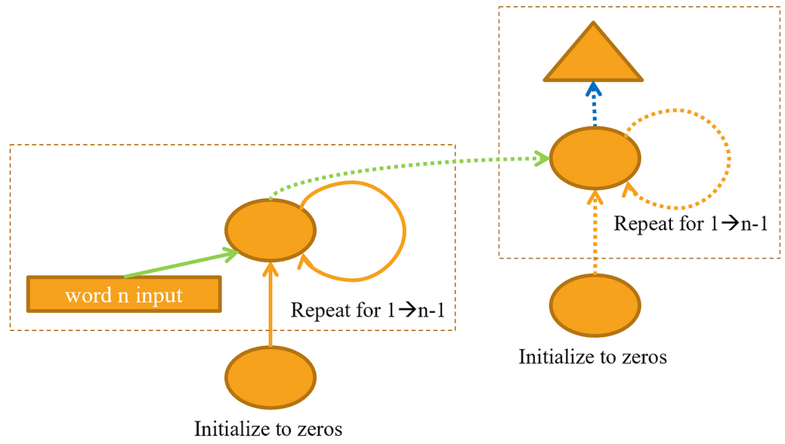

# 12_nlp_dive

## If the dataset for your project is so big and complicated that working with it takes a significant amount of time, what should you do?

Perhaps create the **simplest possible dataset** that allow for quick and easy prototyping. For example, Jeremy created a *human numbers* dataset.

## Why do we concatenate the documents in our dataset before creating a language model?

Because we need to create a continuous stream of input/target words, to be able to split it up in batches of significant size.

## What (2) tweaks do we need to make to use a standard fully connected network to predict the fourth word given the previous three words?

- Use the **same** weight matrix for the three layers.
- Use the **first** word's embeddings as activations to pass to linear layer, add the second word's embeddings to the first layer's output activations, and continues for rest of words.

## How can we share a weight matrix across multiple layers in PyTorch?

Define one layer in the PyTorch model class, and use it multiple times in the `forward` method.

## What is a recurrent neural network?

A refactoring of a **multilayer** neural network using a `for` loop.

[Source](https://github.com/fastai/fastbook/blob/9821dade6e6fb747cc30aceba2923805d5662192/12_nlp_dive.ipynb)

## What is "hidden state"?

The **activations updated** after each RNN step.

## What is the equivalent of hidden state in `LMModel1`?

`h`

## To maintain the state in an RNN why is it important to pass the text to the model in order?

Because the **state is maintained** over all batches independent of sequence length, this is only useful if the text is passed in order.

## What is an unrolled representation of an RNN?

A representation **without loops**, depicted as a standard multilayer network

## Why can maintaining the hidden state in an RNN lead to memory and performance problems?

Because it has to use the **gradients from also all the past calls** of the model when performing backpropagation since the hidden state is maintained through every single call of the model.

## How do we fix the memory and performance problems when the hidden state in an RNN is maintained?

When performing backpropagation with the model, after every call, the `detach` method is called to delete the gradient history of previous calls of the model.

## What is *BPTT*?

Calculating backpropagation only for the **given batch**, and therefore only doing backpropagation for the defined sequence length of the batch. *BPTT* stands for BackPropagation Through Time.

## What does the `ModelResetter` callback do?

It resets the hidden state of the model before every epoch and before every validation run.

## Why do we need the `ModelResetter` callback?

Because it makes sense to reset the hidden state when you are working with **instances or batches** that are **not related in any meaningful way** (to make predictions) e.g. translating two different input instances in neural translation. You can think of the hidden state as limited memory that gets convoluted if the input is too long (and it can be if you combine multiple instances) and, as end result, the final performance may decline.

One more thing, when performing SGD, you assume batches are independent of one another. If you don’t reset the hidden state between them, you lose the i.i.d. assumption.

[Source](https://discuss.pytorch.org/t/in-lstm-why-should-i-reset-hidden-variables/94016/2)

## What are the downsides of predicting just one output word for each three input words?

There are words in between that are **not being used** for training the model.

## How do we solve the downsides of predicting just one output word for each three input word?

We apply the output layer to every hidden state produced to predict three output words for the three input words (offset by one).

## Why do we need a custom loss function for `LMModel4` ?

Because `CrossEntropyLoss` expects flattened tensors.

## Why is the training of `LMModel4` unstable?

Because this network is **very deep** and this can lead to very small or very large gradients that don't train well.

## Why do we need to stack RNNs to get better results, even though a recurrent neural network in the unrolled representation has many layers?

Because **only one weight matrix** is really being used. So multiple layers can improve this.

## Imagine a representation of a stacked (multilayer) RNN

## Why can a deep network result in very large or very small activations?

Because, in deep networks, we have **repeated matrix multiplications** and, after repeated multiplications, numbers that are just slightly higher or lower than one can lead to the explosion or disappearance of numbers.

## Why do very large or very small activations matter ?

Because they could lead to vanishing or exploding gradients which **prevent training**.

## In a computer's floating point representation of numbers, which numbers are the most precise?

Small numbers, that are not *too* close to **zero** however

## Why do vanishing gradients prevent training?

Because the accumulation of small gradients results in a model that is **incapable of learning meaningful insights** since the weights and biases of the initial layers, which tends to learn the core features from the input data, will not be updated effectively. In the worst case scenario the gradient will be 0 which in turn will stop the network will stop further training.

[Source](https://towardsdatascience.com/the-vanishing-exploding-gradient-problem-in-deep-neural-networks-191358470c11)

## Why do exploding gradients prevent training?

Because the accumulation of large derivatives results in the model being very **unstable and incapable of effective learning**. Indeed, the large changes in the models weights creates a very unstable network, which at extreme values the weights become so large that is causes overflow resulting in NaN weight values of which can no longer be updated.

[Source](https://towardsdatascience.com/the-vanishing-exploding-gradient-problem-in-deep-neural-networks-191358470c11)

## What is the purpose of each hidden states in the LSTM architecture?

- One state remembers what happened **earlier** in the sentence
- The other predicts the **next** token

## What are these two states called in an LSTM?

- Cell state (long short-term memory)
- Hidden state (predict next token)

## What is tanh, and how is it related to sigmoid?

It's just a sigmoid function rescaled to the range of -1 to 1.

## In `LSTMCell`, what is the purpose of this code: `h = torch.cat([h, input], dim=1)`?

It **joins the hidden state and the new input**. Concatenating the hidden state and the new input allows the LSTM cell to incorporate the new input into the hidden state and update it accordingly. This allows the LSTM cell to process and make use of both short-term and long-term dependencies in the data, which can improve the model's performance.

Source:

- [First sentence](https://forums.fast.ai/t/fastbook-chapter-12-questionnaire-wiki/70516)
- [The rest](https://chat.openai.com/chat)

## What does `chunk` to in PyTorch?

Splits a tensor in equal sizes

## Why can we use a higher learning rate for `LMModel6` ?

Because LSTM provides a **partial** solution to exploding/vanishing gradients

## What are the (3) regularisation techniques used in an AWD-LSTM model?

1. Dropout
2. Activation regularization
3. Temporal activation regularization

## What is dropout?

To **randomly** change some **activations to zero** at training time. It's a regularization technique that was introduced by Geoffrey Hinton et al. in [Improving neural networks by preventing co-adaptation of feature detectors](https://arxiv.org/abs/1207.0580). This makes sure all neurons actively work toward the output, as seen in <<img_dropout>> (from "Dropout: A Simple Way to Prevent Neural Networks from Overfitting" by Nitish Srivastava et al.).

[Source](https://github.com/fastai/fastbook/blob/9821dade6e6fb747cc30aceba2923805d5662192/12_nlp_dive.ipynb)

## Why do we scale the weights with dropout?

Because the **scale changes** if we sum up activations. Indeed, it makes a difference if all activations are present or they are dropped with probability $p$. To correct the scale, a division by $(1-p)$ is applied.

## When do we scale the weights with dropout ?

During training, inference, or both

## What is the purpose of this line from  `Dropout`:  `if not self.training: return x`?

When not in training mode, don't apply dropout.

## How do you set your model in **training** mode in PyTorch?

`Module.train()`

## How do you set your model in **evaluation** mode in PyTorch?

`Module.eval()`

## What is the equation for l2 activation regularization?

`loss = original_loss + alpha * activations.pow(2).mean()`

or

$$ loss \leftarrow original\_loss + \alpha \cdot \frac{1}{n}\sum_{i=1}^n{activation_i^2} $$

Side note : you could also sum the activations squared instead of taking their average.

## How is the equation for l2 activation regularization different to weight decay using L2 regularisation?

The activation regularization is not decreasing the weights but the **activations**.

## What is the equation for temporal activation regularization (in python)?

`loss = original_loss + beta * (activations[:, 1:] - activations[:, :-1]).pow(2).mean()`

Side note : you could also use `sum()` instead of `mean()`.

## What is *weight tying* in a language model?

It is a technique where we set the **input-to-hidden and hidden-to-output weights** to be **equal**. They are the same object in memory, the same tensor, playing both roles. The hypothesis is that conceptually in a Language Model predicting the next word (converting activations to English words) and converting embeddings to activations are essentially the same operation, the model tasks that are fundamentally similar. It turns out that indeed tying the weights allows a model to train better.

[Source](https://aiquizzes.com/questions/81)
